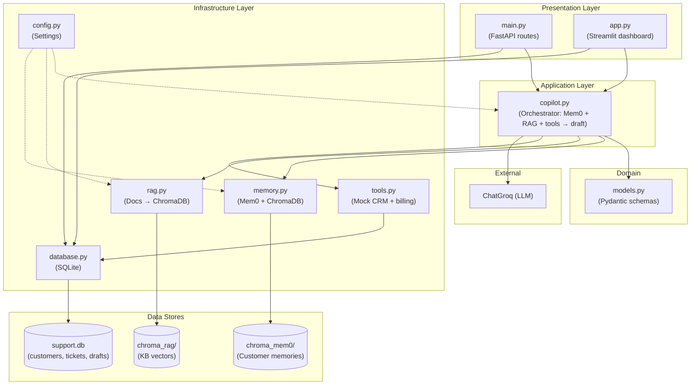
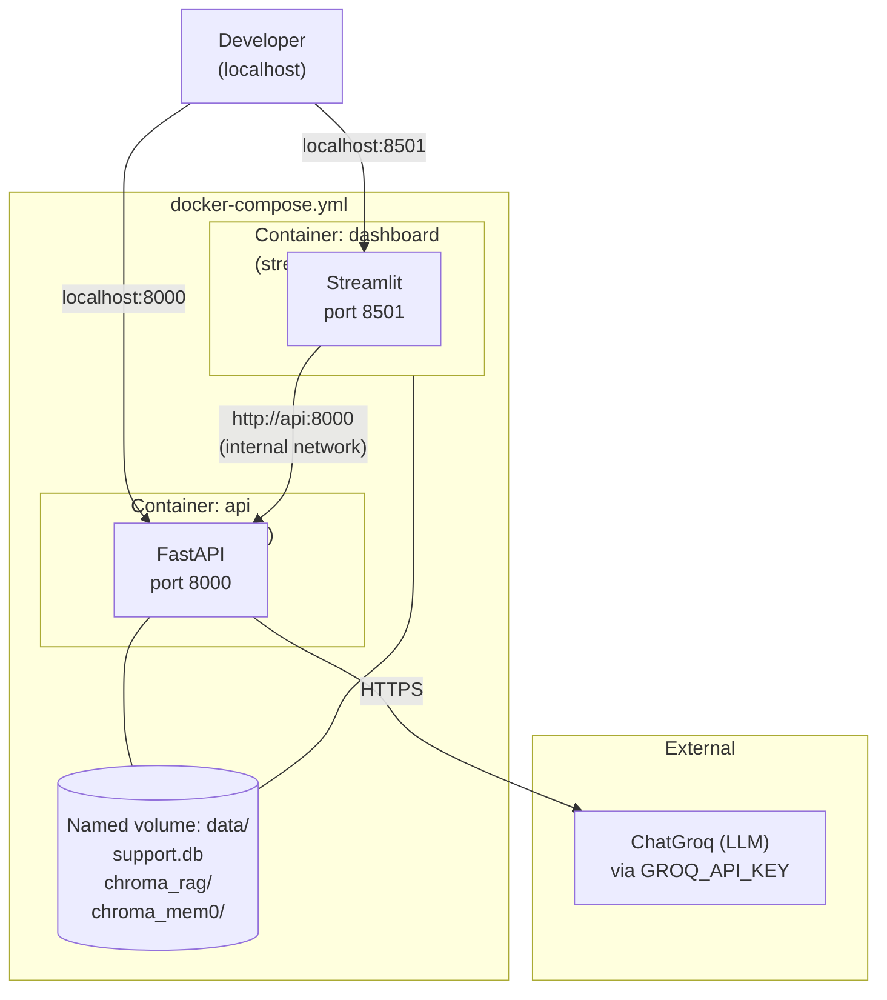
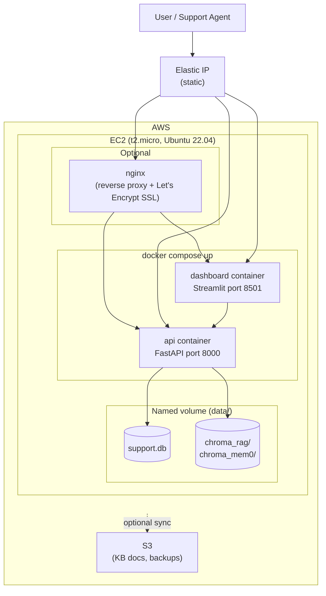

# Architecture Diagrams

Three Mermaid diagrams: **project architecture** (clean layers + data flow), **Docker setup** (how containers connect), and **deployment** (AWS).

---

## 1. Project Architecture

High-level: entry points (FastAPI + Streamlit) → copilot orchestration → infrastructure (DB, memory, RAG, tools) and external LLM.



**Flow (ticket → draft):** Ticket (webhook/form) → `main.py` → save to SQLite + BackgroundTasks → `copilot.py` → customer lookup (SQLite) + Mem0 search + RAG search + optional tool calls → LLM draft → save draft to SQLite → dashboard shows ticket + draft.

---

## 2. Docker Architecture (local development)

Two containers share one image and one named volume. The `dashboard` talks to the `api` over Docker's internal network.



**Key points for beginners:**
- Both containers are built from the **same `Dockerfile`** — they're identical images, just started with different commands
- The `data/` volume is like a shared USB drive — both containers read/write the same SQLite + ChromaDB files
- `http://api:8000` is Docker's internal hostname — containers talk to each other by service name, not `localhost`
- `.env` file is passed to both containers so they get the `GROQ_API_KEY`

**Files added:**
```
Dockerfile            # FROM python:3.11-slim → COPY code → pip install
docker-compose.yml    # defines api + dashboard services + data volume
```

---

## 3. Deployment Architecture (AWS)

Single EC2 instance runs both Docker containers; optional nginx + SSL in front. S3 for KB/backups; Elastic IP for a fixed address.



**Steps:** Launch EC2 (Ubuntu 22.04, t2.micro) → open ports 8000 + 8501 → SSH in → install Docker + Docker Compose → clone repo → `cp .env.example .env` (add key) → `docker compose up -d` → (optional) nginx + Let's Encrypt. **Cost:** ~$0 on free tier, ~$8–10/mo after.
